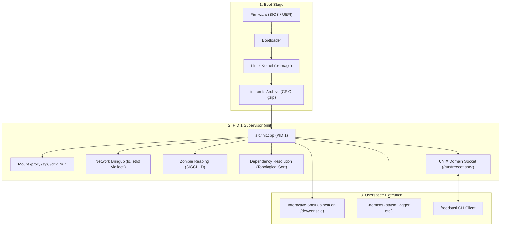

# FreeDot Linux

[](https://github.com/ItzSaurav/freedot-linux/actions/workflows/ci.yml)

FreeDot Linux is a personal, minimal Linux distribution and custom C++ init system built from scratch to explore how Linux boots, manages processes, and initializes userspace without systemd.

---

## Overview

FreeDot pairs an upstream Linux LTS kernel with a lightweight BusyBox userspace and a custom C++20 PID 1 init system.

### Core Components

- **Init System (`src/init.cpp`)**: Runs as PID 1 (`/init`). Mounts virtual filesystems, provisions networking, reaps zombie processes, parses service configurations with dependency ordering, and supervises processes.
- **Control CLI (`src/freedotctl.cpp`)**: Command-line tool to query status, inspect dependencies, restart services, and trigger shutdown or reboot via `/run/freedot.sock`.
- **Telemetry Daemon (`src/statsd.cpp`)**: Periodic metrics logger recording uptime, memory, and process counts to `/var/log/stats.log`.
- **System Logger (`src/logger.cpp`)**: Lightweight background daemon logging boot and runtime events to `/var/log/syslog.log`.

---

## Boot Architecture



---

## Quick Start

### Prerequisites

- Linux or WSL environment
- `g++` (C++20 capable)
- `cpio`, `gzip`
- `qemu-system-x86_64`
- Linux LTS kernel binary (`build/bzImage` or `build/vmlinuz`)

### 1. Compile Binaries

Compile static binaries with zero external shared library dependencies:

```bash
mkdir -p build/rootfs/bin build/rootfs/etc/freedot.d
g++ -std=c++20 -static -O2 src/init.cpp -o build/rootfs/init
g++ -std=c++20 -static -O2 src/freedotctl.cpp -o build/rootfs/bin/freedotctl
g++ -std=c++20 -static -O2 src/statsd.cpp -o build/rootfs/bin/statsd
g++ -std=c++20 -static -O2 src/logger.cpp -o build/rootfs/bin/logger
```

### 2. Package the Root Filesystem

Package the rootfs directory into a bootable `initramfs.cpio.gz` archive:

```bash
./scripts/build_rootfs.sh
```

### 3. Run with QEMU

Launch the virtual machine in headless serial mode:

```bash
./scripts/run_qemu.sh
```

To exit QEMU: press `Ctrl + A` then `X`, or run `freedotctl poweroff` inside the shell.

---

## Service Management (`freedotctl`)

Use `freedotctl` inside the running system to manage services over the UNIX domain socket:

| Command | Action |
| :--- | :--- |
| `freedotctl status` | Show status and PID of all configured services |
| `freedotctl deps` | Print startup dependency graph and order |
| `freedotctl restart <name>` | Send SIGTERM to restart a specific service |
| `freedotctl reload` | Reload unit files from `/etc/freedot.d/` |
| `freedotctl poweroff` | Terminate services, sync disks, and shut down |
| `freedotctl reboot` | Terminate services, sync disks, and reboot |

---

## Service Unit Configuration

Define services by creating `.conf` files inside `/etc/freedot.d/`:

```ini
# Example: /etc/freedot.d/statsd.conf
name=statsd
exec=/bin/statsd
type=daemon
respawn=true
after=logger
```

### Configuration Directives

- `name`: Unique name for the service.
- `exec`: Absolute path to the executable binary.
- `type`: `daemon` (background process) or `interactive` (attached to terminal).
- `respawn`: `true` to restart automatically if the process exits, or `false`.
- `after`: Comma-separated list of service dependencies that must start before this service.

---

## Repository Structure

```text
freedot-linux/
├── .github/workflows/
│   └── ci.yml             # Automated C++20 build and test pipeline
├── scripts/
│   ├── build_rootfs.sh    # Packages rootfs into initramfs.cpio.gz
│   └── run_qemu.sh        # Boots kernel and initramfs inside QEMU
├── src/
│   ├── freedotctl.cpp     # Management CLI client
│   ├── init.cpp           # Custom C++20 PID 1 init and supervisor
│   ├── init_test.cpp      # Standalone userspace test suite
│   ├── logger.cpp         # System logging daemon
│   └── statsd.cpp         # Telemetry reporting daemon
├── .gitignore             # Ignored build artifacts
└── README.md              # Project documentation
```

---

## Project Status

Personal systems engineering and learning project.
